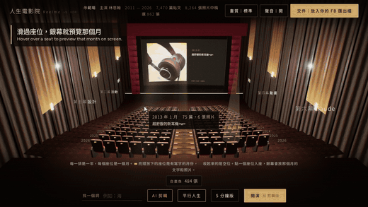
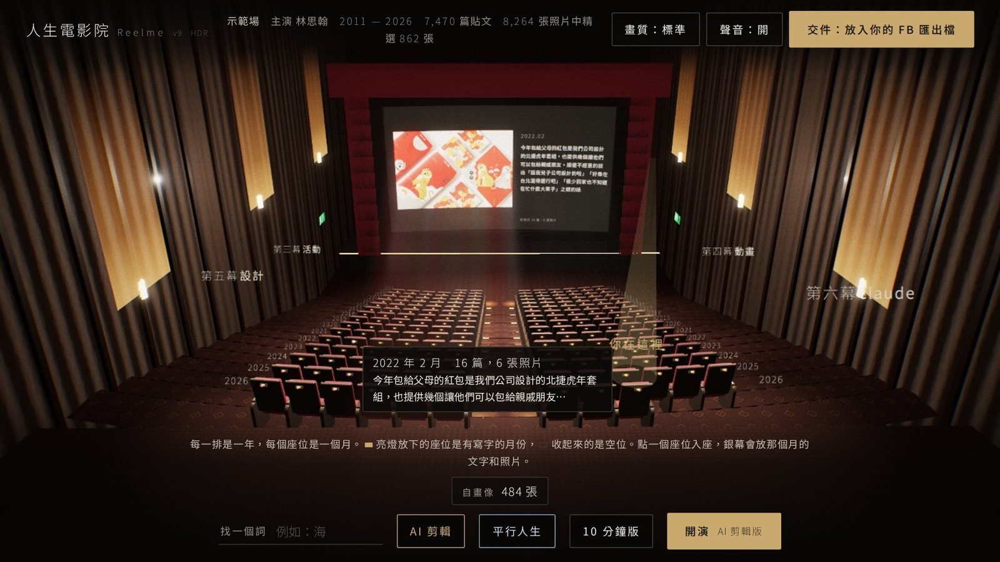
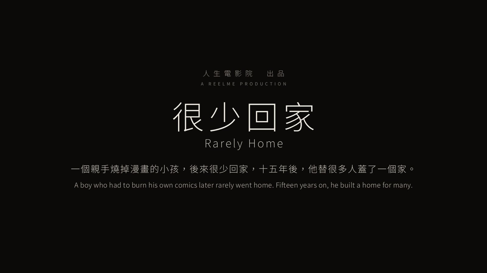
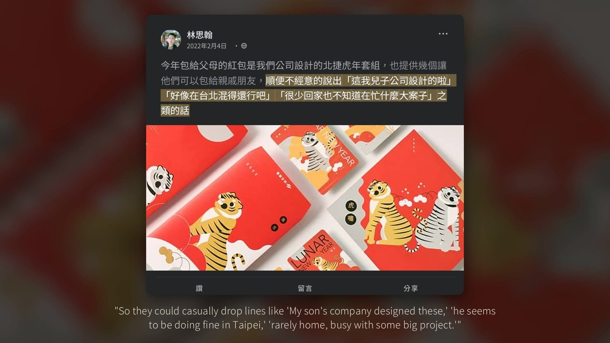
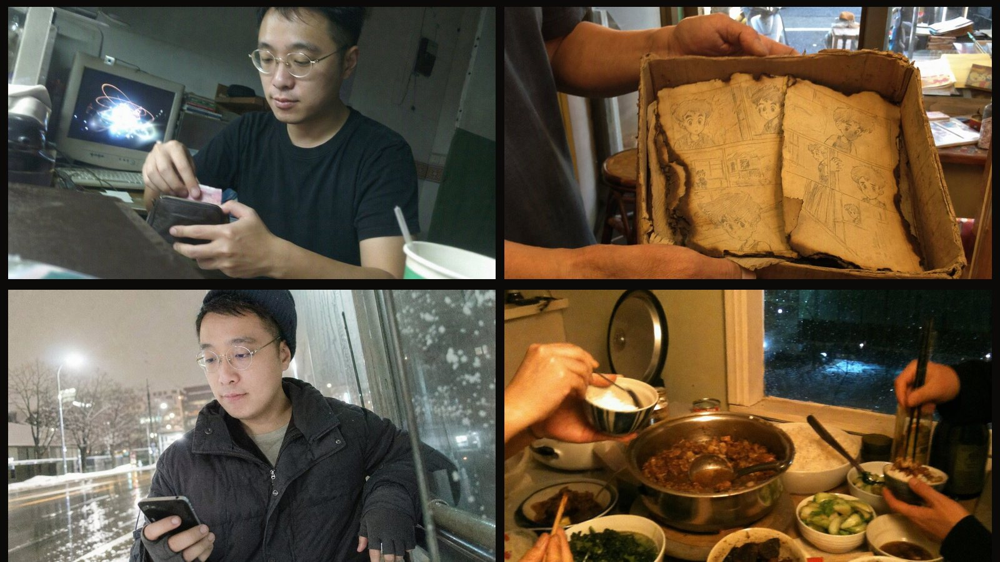
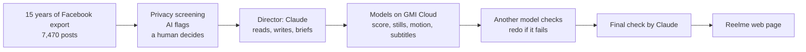
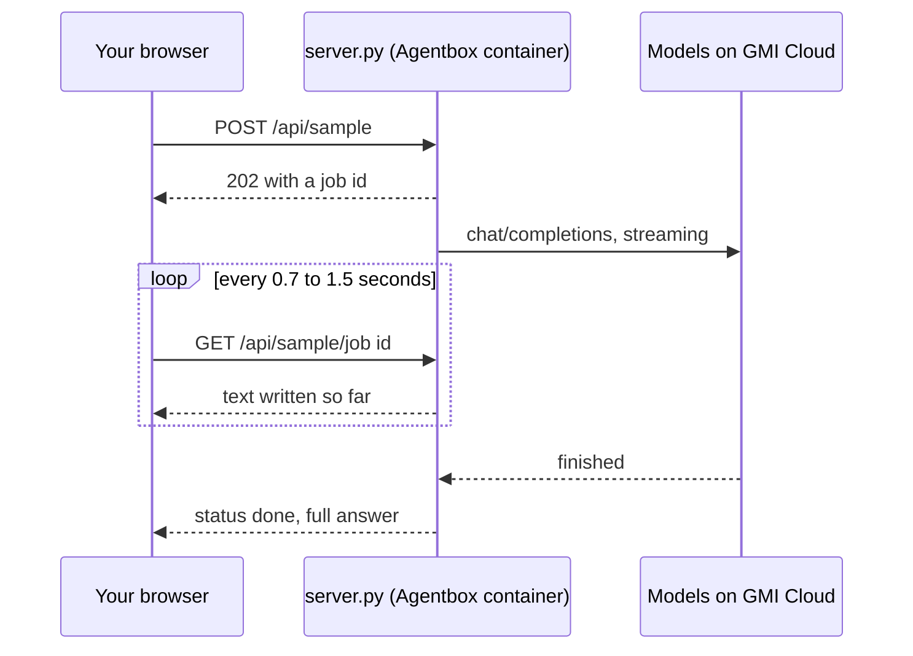

# Reelme · 人生電影院

[繁體中文](README.md) · **English**

Reelme is a web app that reads the posts and photos a person has shared on Facebook over the years, builds them a 3D cinema they can walk into, and cuts their life into a film.

I'm Hans Lin, the author. The version here is built from my own 15 years on Facebook. You can open it and look around, or bring your own Facebook export and try it.

> For more than ten years I directed other people's stories. This time AI directed mine. All I provided was the material, which is to say, myself.

**Live preview: <https://claude.ai/artifact/MmbfDiGXxtLqQe6zaBfh4L>** (desktop Chrome recommended, with sound on)



**Quick start in three steps**

1. Open the live preview above and wait for the opening animation to finish.
2. Hover over a seat and the screen previews that month. Click it to read what was posted that month.
3. Press 「開演」 (Play) at the bottom right to watch the full film.

> The cinema's interface is in Traditional Chinese. In this guide, buttons are quoted exactly as they appear on screen, followed by an English translation.

## Contents

1. [Why I made this](#1-why-i-made-this)
2. [What it does](#2-what-it-does)
3. [Technology](#3-technology)
4. [How to use it](#4-how-to-use-it)
5. [Troubleshooting](#5-troubleshooting)
6. [Privacy](#6-privacy)
7. [Terms of use](#7-terms-of-use)

---

## 1. Why I made this

**I wanted to know what story I had been telling for 15 years.**

I'm an AI director at Group.G, with more than ten years in motion design, and I have told many stories for brands such as TSMC, Samsung, LINE and ASUS.

For all those years I directed other people's stories. This time I wanted to turn it around, let AI direct me, and see how it would tell my life.

In July 2026 I exported 15 years of Facebook: 7,470 posts, about 5 GB.

That is a lot of numbers, but a report only tells me what happened. A film tells me what it meant. So I decided to make it into a film.

**I wanted to test whether one person and one platform could do the work of a whole film crew.**

A film needs a script, a score, stills, motion shots and subtitles. That used to mean different people, different tools and different accounts.

GMI Cloud is a cloud platform for AI models and compute. Its model service, MaaS, gives a single API key access to text, image, music and video models from many companies.

I handed all of that work to models on GMI Cloud, and the first working version cost about US$75 in credits.

**I wanted more people to walk into their own cinema.**

Everyone's data holds a film, and companies are no different: ten years of press releases, event photos and customer stories that nobody has ever read as one story.

I started with myself. The same approach works for brand anniversary films, founder and team stories, customer journey recaps, and memory films for communities and alumni.

So I packaged the whole cinema and deployed it on GMI Agentbox.

Agentbox is GMI Cloud's hosting service for AI agents. You give it a Docker image, it runs the program and injects the key for calling models. Through it, anyone can bring their own Facebook export and get a life cinema of their own.

This project is also what I'm presenting at GMI Cloud Day APAC on 29 October 2026.

---

## 2. What it does

The live preview runs the version built from my own data, called "the showcase" below. When you bring your own data, you get your own cinema, film and AI features.

### 2.1 A 3D cinema where every seat is a month of a life

Each row in the cinema is a year and each seat is a month. The brighter the seat, the more was written that month. The showcase covers 2011 to 2026 with 185 seats.

Hover over a seat and the screen in front previews that month. Click it and the camera flies into the seat, so you can read that month's posts one by one, start the film from that month, or branch off into another life from there.

Type a keyword into 「找一個詞」 (Find a word) and every month where it appears lights up with a beam, with the first and last posts that used it shown alongside.

### 2.2 The film *Rarely Home* 《很少回家》

The showcase film is called *Rarely Home*. Here is its logline.

> A boy who had to burn his own comics later rarely went home. Fifteen years on, he built a home for many.

- **AI wrote the narration, the quotes are unedited**: the film has six acts. The narration was written by AI, and every quote on screen is something I actually wrote on Facebook, word for word.
- **Every line has a source**: during playback, press and hold the screen or press the space bar to pause and see the original post and its date. Narration lists the posts it was based on.
- **10-minute and 5-minute cuts**: both are drawn live by the web page, not pre-rendered video files.
- **Original score**: MiniMax Music 3.0 composed instrumental music, with no lyrics, for each section. 8 of 23 tracks made the cut, and the climax of the last one lands exactly as the self-portrait comes together.
- **Self-portrait**: 484 photos from over the years form a single face, shown at the end of the film.
- **Event cut**: the version screened at the event is a separately exported 1080p video. It opens with a 25-second walkthrough of the website, shows each quote highlighted on the original post, and adds Chinese and English subtitles. The third and fourth images under "Screenshots" come from this cut.

### 2.3 Parallel lives: what if I had taken the other road

AI read my real posts up to each turning point and imagined two lives I never lived. These films are labelled as fiction and screened separately from the real film, and all three lives can also be played side by side.

| Parallel life | Turning point | What if |
|---|---|---|
| **Life Two: *The Two Pages That Didn't Burn*** 《沒燒完的兩頁》 | August 2013 | Twelve hours before moving, he cancels the Taipei lease, stays in Kaohsiung, and picks up the pen that was burned. |
| **Life Three: *The Man Without Lines*** 《沒有台詞的人》 | July 2015 | After leaving BITO, instead of taking freelance work in Shanghai, he sends his résumé to Vancouver. |

The stills were generated with GPT Image 2, 20 chosen from more than a hundred. Motion shots use Veo 3.1 and the score uses MiniMax Music 3.0.

### 2.4 AI features in the page

Once you bring your own Facebook export, three AI features are available. In the Agentbox version, all of them are answered by models on GMI Cloud.

| Feature | What it does |
|---|---|
| **AI cut** 「AI 剪輯」 | AI reads your posts and photos and cuts a structured film in about three to eight minutes, in three steps. Reading: it decides whether each post is a turning point, a mood, daily life, or a share or promotion. Looking: photos are laid out as contact sheets for a vision model, which tells life photos from ads and prefers photos with faces. Structuring: it finds the through-line of your life, splits acts at real turning points, and finds callbacks years apart. |
| **Parallel life** 「第二人生」 | Pick a turning point and write down the road you didn't take. AI reads about forty posts around that point and imagines another film, marked as fiction. |
| **Birth chart reading** | Optional. Enter your birth date, time and place, the page draws a Western natal chart, and AI interprets it. The parallel life uses it as character background. |

### 2.5 Packaged for GMI Agentbox

- The page, the showcase data, photos, score and parallel-life videos are packaged into one Docker image.
- The page barely changes: a small script, `gmi-shim.js`, forwards its AI requests to the server in the same container, `server.py`, which calls models on GMI Cloud.
- Each kind of task has a primary model and backup models. When the primary fails, a backup takes over automatically, and changing models is a setting, not a code change.
- When code is pushed to GitHub, it is tested and the image is rebuilt automatically.

### 2.6 Results

| Figure | Meaning |
|---|---|
| **≈ US$75** | GMI Cloud credits for the first working version |
| **10+ auditioned, 7 cast** | Models in the final cut, across text, image, music and video |
| **23 → 8** | Score tracks kept |
| **100+ → 20** | Parallel-life stills kept |
| **1,267** | Photos screened for privacy |
| **4 errors** | Real translation errors caught when a second model reviewed the English subtitles |

### Screenshots

| | |
|---|---|
|  |  |
| **The hall** Each row is a year and each seat a month. Hover over a seat to preview that month on the screen. | **Taking a seat** Click a seat, the camera flies in, and you read what was written that month. |
|  |  |
| ***Rarely Home*** The event cut, with Chinese and English subtitles. | **Original post card** In the event cut, each quote is highlighted on the original post. |
|  |  |
| **Self-portrait** A face made of 484 photos. | **Parallel lives** If I had stayed in Kaohsiung, or gone to Vancouver. |

---

## 3. Technology

### 3.1 How it was made: AI as director, other models as crew

The showcase film was directed by Claude, made by Anthropic. It read the material, wrote the script and narration, briefed the other models and checked the result. Every model that composed music or generated stills, motion shots and subtitles was called through a single GMI Cloud API key.



| Role | Model | Job |
|---|---|---|
| Director | Claude | Reads the material, writes the script and narration, briefs the other models, checks the result |
| Composer | MiniMax Music 3.0 | Writes instrumental music for each section of the story |
| Listener | Gemini 3.8 Flash | Listens to every track and sends it back if it has lyrics, vocals or sudden volume jumps |
| Privacy check | Gemini 3.8 Flash, GPT-6 Luna | Gemini looks at photos, GPT-6 Luna reads posts that mention family |
| Stills | GPT Image 2 | Generates parallel-life stills that should look like casual phone photos |
| Motion | Veo 3.1 | Turns stills into a few seconds of motion |
| Subtitles | GPT-6 Luna, Kimi K3 | GPT-6 Luna translates, Kimi K3 reviews every line against the Chinese |

**Choosing models felt more like casting than coding.**

- **Recast when it doesn't work**: DeepSeek V4 Flash kept returning blanks. I changed one model name in the code to switch to GPT-6 Luna, and nothing else in the pipeline had to change.
- **Audition side by side**: the same prompt went to two image models to see which face looked more like me. GPT Image 2 beat Gemini 3 Pro Image.
- **Understudies on call**: if Gemini 3.8 Flash, which looks at photos, fails, 3.7 Flash takes over, then 3.1 Pro, so the shoot never stops.

**Generating is cheap. Checking is the bottleneck. So one model makes and another one checks.**

- **Score**: MiniMax composes, Gemini listens, and 8 of 23 tracks are kept.
- **Subtitles**: GPT-6 Luna translated 36 lines in 18 seconds, then Kimi K3 reviewed every line against the Chinese and caught 4 real errors: one meaning was flipped, one line was misread, one sentence was translated that wasn't on screen, and one detail was added that wasn't in the original.

**Jobs that take minutes, such as music and video, go into GMI Cloud's request queue in parallel and are collected when they finish.**

### 3.2 The page: one HTML file is the whole cinema

| Part | Technology |
|---|---|
| 3D cinema | three.js r147 (WebGL) with area lights and post-processing. Devices without WebGL fall back to a flat mode. |
| The film on screen | Canvas 2D draws 1920×1080 frames live, so when the edit changes, the film changes with it. |
| Sound | Web Audio API mixing. The showcase uses the MiniMax score, and your own data gets a score generated live from your posting times. |
| Reading the export | zip.js opens the ZIP files in the browser, with no unzipping and no upload. |
| Birth chart | Astronomy Engine computes planet positions, using the tropical zodiac and Placidus houses, within one arcminute of Swiss Ephemeris. |
| Self-portrait | Canvas photo mosaic. Colour correction only nudges each photo's tone toward the target; the photo itself is unchanged. |
| Accessibility | Arrow keys choose a seat, Enter takes it, and the system's reduce-motion setting is respected. |

The page needs no compiling or build step. `agentbox/static/index.html` is about 440 KB, and the rest of that folder is the showcase data, photos, score and parallel-life videos.

### 3.3 How the event cut was exported

- Playwright opens the page and captures the screen frame by frame, and ffmpeg encodes it as 1080p video at 30 frames per second.
- The score is mixed offline with OfflineAudioContext and normalised to −17 LUFS.
- The website walkthrough at the start was also captured frame by frame, with the cursor, clicks and bilingual captions layered on afterwards.

### 3.4 Agentbox architecture

| File | Role |
|---|---|
| `agentbox/server.py` | The server, using only Python's standard library. It serves the page on port 8080, a health check at `/health`, and the AI endpoint at `/api/sample`. |
| `agentbox/gmi-shim.js` | When the page is not opened inside Claude, forwards the page's AI requests to `/api/sample`. |
| `agentbox/static/` | The cinema page and showcase assets. |
| `agentbox/Dockerfile` | Builds a linux/amd64 image that runs as an unprivileged user, with a built-in health check. |
| `.github/workflows/agentbox-image.yml` | On every update, starts the server to confirm it responds, then builds the image and pushes it to `ghcr.io/hansai-art/reelme-agentbox`. |

**Long AI jobs take a ticket and come back later.** Agentbox requires requests longer than about 30 seconds to return a job id first. The last step of the AI cut often takes several minutes, so the server returns a job id immediately and calls the GMI Cloud model in the background with streaming. The page checks progress every 0.7 to 1.5 seconds and shows the text as the model writes it.



**Model roles.** Each kind of task has a primary model and backups. When the primary returns nothing, errors out or takes too long, the next one is tried automatically.

| Task | Primary model | Backups |
|---|---|---|
| General reading and reasoning | `openai/gpt-6-luna` | `moonshotai/kimi-k3`, `openai/gpt-5.6-sol` |
| Writing the structure of the whole film | `openai/gpt-6-sol` | `openai/gpt-6-luna`, `moonshotai/kimi-k3` |
| Looking at photo contact sheets | `google/gemini-3.8-flash` | `google/gemini-3.7-flash` |
| Small, quick tasks | `openai/gpt-6-luna` | `moonshotai/kimi-k3` |

**Safeguards.** AI requests are capped per IP over ten minutes, and the number of AI jobs running at once is capped. A single request can be at most 12 MB. Pressing 「停止」 (Stop) cancels the background job. The page and assets are served compressed with range requests, so videos can be scrubbed.

**Measured speed** (October 2026, from my own computer to GMI Cloud)

| Test | Result |
|---|---|
| GPT-6 Luna, short answer | 3.7 s |
| GPT-6 Sol, streamed long answer | 5.5 s |
| Gemini 3.8 Flash, reading an image | 5.5 s |
| A full parallel-life run | 12 s, with all 9 scenes parsed by the page |
| Cancelling midway | Background job stopped correctly |

---

## 4. How to use it

### 4.1 Watch the showcase

Open the [live preview](https://claude.ai/artifact/MmbfDiGXxtLqQe6zaBfh4L), wait for the opening animation to finish, and explore.

| To do this | Do this |
|---|---|
| Preview a month | Hover over a seat |
| Read that month's posts | Click the seat to sit down, use 「上一篇」 (Previous) and 「下一篇」 (Next) to page through, and press 「回到全景」 (Back to overview) when you're done |
| Watch the full film | Press 「開演」 (Play) at the bottom right. The button next to it switches between the 10-minute and 5-minute cuts |
| Start from a given month | After sitting down, press 「從這個月開演」 (Play from this month) |
| See the original of a line | During playback, press and hold the screen, or press the space bar to pause |
| Find a word | Type it into 「找一個詞」 (Find a word). Months where it appears light up |
| Watch the parallel lives | Press 「第二人生」 (Second life), then choose a life, or choose 「三條人生」 (Three lives) to play them side by side |
| Use the keyboard | Arrow keys choose a seat, Enter takes it |

### 4.2 Bring your own Facebook data

**Step 1: request your data from Facebook**

1. In Facebook settings, open Accounts Center, then Your information and permissions, then Export your information or Download your information.
2. Choose your Facebook profile and set the date range to All time.
3. Set the format to JSON, not HTML, and the media quality to High.
4. Select at least Posts, and Photos and videos.
5. Facebook notifies you when the export is ready, usually after one to three days. Download every ZIP file.

**Step 2: bring it into the cinema**

1. Press 「交件：放入你的 FB 匯出檔」 (Submit: add your FB export) at the top right and drag the ZIP files in. If Facebook split the export into several ZIPs, select them all at once. There is no need to unzip them.
2. The cinema rearranges its seats around your posts. Then press 「AI 剪輯」 (AI cut) to let AI read your posts and photos and cut a structured film. It takes about three to eight minutes. When it's done, press 「放映 AI 剪輯版」 (Play the AI cut).
3. To see another life, press 「第二人生」 (Second life), pick a turning point, and write down the road you didn't take.
4. For a self-portrait, pick a front-facing headshot as the base image, and the cinema assembles a face from your photos for the end of the film.

**Where your data goes**

- The export is opened only in your own browser on this computer. It disappears when you close the tab, and you can press 「清空本場資料」 (Clear this session) at any time.
- The page never reads your messages, comments or friend list.
- Post text, photo thumbnails and the work history on your profile are sent to AI models only when you press 「AI 剪輯」 (AI cut) or 「第二人生」 (Second life), and the page tells you before it sends anything.
- The live preview is hosted on Claude, so its AI features use your own Claude account and ask for your consent the first time. The version deployed on Agentbox uses models on GMI Cloud instead.

### 4.3 Deploy on GMI Agentbox

The image is already built and public at `ghcr.io/hansai-art/reelme-agentbox:latest`, and it is rebuilt on every update.

1. In the Agentbox registration wizard, enter:
   - Image: `ghcr.io/hansai-art/reelme-agentbox:latest`
   - Port: `8080`, health check path: `/health`
   - No model key is needed. Agentbox injects `GMI_MAAS_API_KEY` and `GMI_MAAS_BASE_URL` automatically.
2. The 2 vCPU, 4 GB RAM size Agentbox currently offers is enough. The server itself is light, and the heavy work runs on GMI Cloud's models.
3. Once deployed, open the URL Agentbox gives you and you're in the cinema. Add `/health` to the end of the URL; `"key": true` means the model key was injected.

To deploy your own modified version, fork this repository and push to your own GitHub. GitHub Actions builds the image and publishes it as `ghcr.io/your-account/reelme-agentbox`. A newly built image may start out private; make it public on your GitHub Packages page, or give Agentbox your GitHub username and a Personal Access Token with only `read:packages`.

### 4.4 Run it on your own computer

You need Python 3.8 or later, with no other packages. Set `GMI_MAAS_API_KEY` to the API key from your GMI Cloud account, then from the root of the repository run:

```bash
cd agentbox
GMI_MAAS_API_KEY=your-key python3 server.py
# open http://localhost:8080
```

Or with Docker:

```bash
docker build -t reelme-agentbox agentbox
docker run -p 8080:8080 -e GMI_MAAS_API_KEY=your-key reelme-agentbox
```

Or run the published image directly:

```bash
docker run -p 8080:8080 -e GMI_MAAS_API_KEY=your-key ghcr.io/hansai-art/reelme-agentbox:latest
```

The server also starts without a key. The cinema, the film and the showcase parallel lives all work, and the AI features report that the service is unavailable.

### 4.5 Change models and limits

To change models, set environment variables; no code changes are needed. List several models separated by commas: the first is the primary, and the rest are backups in order.

| Environment variable | Default | Purpose |
|---|---|---|
| `REELME_MODELS_DEFAULT` | `openai/gpt-6-luna,moonshotai/kimi-k3,openai/gpt-5.6-sol` | General reading and reasoning |
| `REELME_MODELS_COMPLEX` | `openai/gpt-6-sol,openai/gpt-6-luna,moonshotai/kimi-k3` | Writing the structure of the whole film |
| `REELME_MODELS_VISION` | `google/gemini-3.8-flash,google/gemini-3.7-flash` | Looking at photos |
| `REELME_MODELS_QUICK` | `openai/gpt-6-luna,moonshotai/kimi-k3` | Small, quick tasks |
| `REELME_RATE_PER_10MIN` | `80` | Maximum AI requests per IP in ten minutes |
| `REELME_CONCURRENCY` | `4` | AI jobs that can run at the same time |
| `REELME_MAX_TOKENS` | `8000` | Maximum length of each answer |
| `GMI_MAAS_BASE_URL` | `https://api.gmi-serving.com/v1` | GMI Cloud model endpoint, injected by Agentbox |

### 4.6 For developers: the AI endpoint

To connect your own front end, call `/api/sample` directly.

```http
POST /api/sample
Content-Type: application/json

{
  "input": "a string, or a conversation like [{\"role\": \"user\", \"content\": \"...\"}]",
  "tier": "default",
  "json": true,
  "images": ["data:image/jpeg;base64,..."]
}
```

- `tier` is `quick`, `default` or `complex`. Requests with `images` always go to the vision models, with at most 8 images.
- When `json` is `true`, the model is asked to output JSON only.
- The response is `202 {"id": "..."}`. Then poll `GET /api/sample/<id>` for `status` (`running`, `done` or `error`), `text`, `model` and `truncated`.
- `DELETE /api/sample/<id>` cancels the job.
- Error codes: `400 bad_request`, `413 too_large`, `429 rate_limited`, `503 unavailable`.

---

## 5. Troubleshooting

### Deployment

**`/health` shows `"key": false`, and every AI feature says the service is unavailable**

- Cause: the server did not receive `GMI_MAAS_API_KEY`.
- On Agentbox: make sure the agent uses GMI MaaS so the key is injected, and redeploy after changing the settings.
- On your own computer: set `GMI_MAAS_API_KEY` before starting the server, as in "Run it on your own computer" above.

**The Agentbox health check keeps failing and the container restarts**

- The port must be `8080` and the health check path must be `/health`.
- The server answers about one second after starting, and the first log line reads `Reelme on :8080 key=set`. If that line is missing, the program did not start; check the log for the error.
- The image is linux/amd64, so the runtime must support that architecture.

**Docker on an Apple Silicon Mac shows `exec format error` or a platform warning**

- The image is linux/amd64. Add `--platform linux/amd64` to the `docker run` command, or run it with Python instead.

**Starting it on your own computer fails with `Address already in use`**

- Something else is using port 8080. Start on another port, for example `PORT=8090 python3 server.py`.

### AI features

**AI says 「GMI 模型目前太忙或已達使用上限」 (busy or usage limit reached)**

- More than the allowed number of AI requests (80 by default) came from the same IP within ten minutes. Wait ten minutes, or raise `REELME_RATE_PER_10MIN`.
- If GMI Cloud is briefly busy, the server switches to a backup model automatically and only reports an error when every model has failed.

**AI keeps failing, and the log shows `recast: <model> HTTP 404` or `HTTP 403`**

- That model isn't available to your GMI account or region. Check the model list in GMI Cloud for the names you can use, then set `REELME_MODELS_DEFAULT`, `REELME_MODELS_COMPLEX`, `REELME_MODELS_VISION` and `REELME_MODELS_QUICK` to available models.
- `HTTP 401` means the key is invalid or has expired.

**The AI cut takes a long time**

- Three to eight minutes is normal, and more posts take longer. The page keeps showing progress, so you can explore the cinema meanwhile.
- If there is no progress after fifteen minutes, press 「停止」 (Stop) and start again, and check the log for lines starting with `recast`.

**AI says 「AI 回來的內容格式不完整」 (the response was incomplete)**

- Models occasionally return incomplete JSON, and trying again usually works.
- If it happens often, put a stronger model first in `REELME_MODELS_COMPLEX`, or raise `REELME_MAX_TOKENS` so answers aren't cut off.

### The web page

**The cinema is black, or very slow**

- The 3D cinema needs WebGL. Use desktop Chrome or Edge, with hardware acceleration turned on in the browser.
- Lower the quality with 「畫質」 (Quality) at the top right. Devices without WebGL switch to a flat mode that shows only the screen.

**The 3D cinema doesn't appear, or adding the ZIP shows 「解壓元件沒有載入」 (the unzip component didn't load)**

- The page loads three.js, zip.js and the birth chart library from `cdn.jsdelivr.net`. Corporate networks or firewalls that block that domain leave parts missing. Try another network, or ask your network admin to allow `cdn.jsdelivr.net`.

**There is no sound**

- Browsers don't play sound until you click the page. Click once, then check that 「聲音」 (Sound) at the top right is on.

**Nothing happens after adding the Facebook export, or no posts are found**

- The export must be in JSON format. HTML exports can't be read.
- If Facebook split the export into several ZIPs, select them all at once.
- Exports of several GB need a desktop browser with enough memory; phones may not finish.

**The AI features in the live preview ask me to sign in**

- The live preview is hosted on Claude, so using its AI features there requires a Claude account and uses your own Claude usage.
- To avoid depending on Claude, deploy on Agentbox or run it on your own computer.

---

## 6. Privacy

Because this uses my own real data, privacy came first. The rule was simple: AI flags anything that might be a problem, and I make the final call.

- Gemini looked at 1,267 photos and flagged children, family, IDs, bills and private conversations. GPT-6 Luna read 115 posts that mention family, and I personally reviewed 457 photos.
- 83 posts were kept off screen, and their text has been removed from the data file. 80 keep only their timestamp, and the 3 quoted in the film keep only a version with the family passages removed.
- Photos of my children, my wife, private messages, IDs and bills were excluded while the data was prepared and are not in this repository.
- `agentbox/static/` contains only the posts and photos the page actually uses. Everything else was excluded before packaging.
- This repository contains no API keys. The key is injected by Agentbox at run time.
- The AI endpoint limits usage per IP, to prevent abuse of a deployed URL.

---

## 7. Terms of use

- You're welcome to read and learn from the code. If you'd like to use it in your own project, please contact me first through GitHub at [@hansai-art](https://github.com/hansai-art).
- The posts, photos, music and videos in `agentbox/static/` belong to me and are here only to demonstrate this project. Please don't republish them, use them to train models, or use them for anything else.

---

Hans Lin 林思翰, AI Director, Group.G
