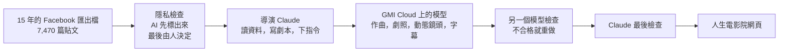
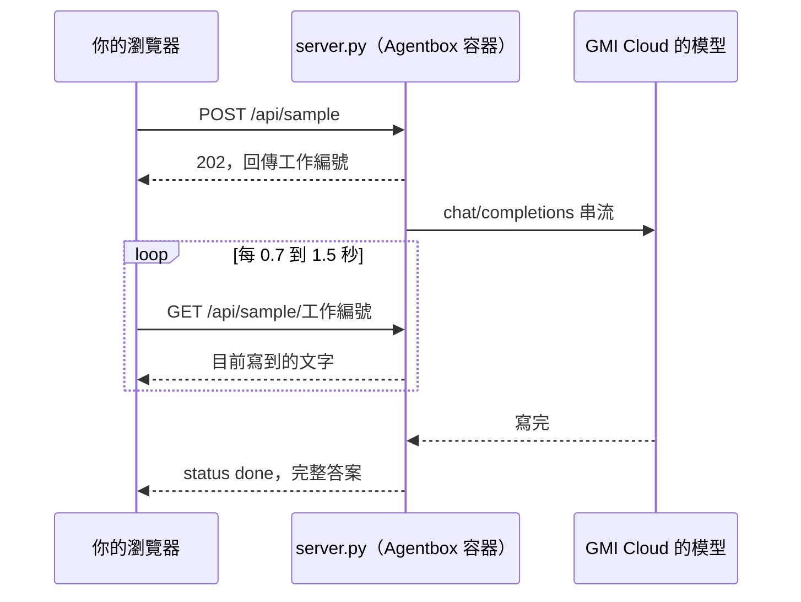

# 人生電影院 Reelme：GMI Agentbox 版

**繁體中文** · [English](README.en.md)

這個資料夾是人生電影院部署到 GMI Agentbox 的版本，以下是完整的專案介紹，和 [repo 首頁](../README.md) 的說明相同。

> **English:** the full guide in English, including installation, usage and troubleshooting, is in [README.en.md](README.en.md).

人生電影院是一個網頁，它會讀一個人多年來在 Facebook 寫下的貼文和照片，替他蓋一座可以走進去的 3D 電影院，再剪成一部關於他人生的電影。

我是作者林思翰，這裡展示的是用我自己 15 年的 Facebook 做成的版本，你可以直接打開來看，也可以放入你自己的 Facebook 匯出檔試試看。

> 十多年來，我都在當別人的導演，這一次換 AI 當我的導演，說我的人生故事，我只負責提供素材，也就是我自己。

**線上預覽：<https://claude.ai/artifact/MmbfDiGXxtLqQe6zaBfh4L>**（建議用電腦版 Chrome，並打開聲音）


**三步驟快速開始**

1. 打開上面的線上預覽，等開場動畫結束。
2. 滑鼠滑過座位，銀幕會預覽那個月，點下去就能讀那個月的貼文。
3. 按右下角的「開演」，看完整的電影。

## 目錄

1. [為什麼做這個專案](#一為什麼做這個專案)
2. [這個專案做了什麼](#二這個專案做了什麼)
3. [用了哪些技術](#三用了哪些技術)
4. [怎麼使用](#四怎麼使用)
5. [疑難排解](#五疑難排解)
6. [隱私](#六隱私)
7. [使用範圍](#七使用範圍)

---

## 一、為什麼做這個專案

**我想知道，自己這 15 年一直在說什麼故事。**

我在 Group.G 擔任 AI 導演，做動態設計超過十年，替台積電，Samsung，LINE，ASUS 這些品牌說過很多故事。

十多年來，我都在當別人的導演，這一次我想反過來，讓 AI 當我的導演，看它會怎麼說我的人生。

2026 年 7 月，我把 15 年的 Facebook 全部匯出來，一共 7,470 篇貼文，檔案大約 5GB。

數字很多，但統計報告只會告訴我發生了什麼，電影才會告訴我那代表什麼，所以我決定把它拍成一部電影。

**我想驗證，一個人加上一個平台，能不能完成一整個劇組的工作。**

一部電影要有劇本，配樂，劇照，動態鏡頭和字幕，以前要找不同的人，用不同的工具，申請不同的帳號。

GMI Cloud 是一個提供 AI 模型與運算的雲端平台，它的模型服務 MaaS 只要一把 API 金鑰，就能呼叫不同公司的文字，圖片，音樂和影片模型。

這一次我把這些工作全部交給 GMI Cloud 上的模型，結果大約花了 75 美元的使用額度，就做出第一個可用的版本。

**我想讓更多人，也走進自己的電影院。**

每個人的資料裡都藏著一部電影，企業也一樣，十年的新聞稿，活動照片和客戶故事，往往沒有人把它們當成一個故事看過。

我先拿自己做示範，同一套做法也可以用在品牌週年影片，創辦人與團隊故事，客戶旅程回顧，或社群與校友的回憶影片。

所以我把整座電影院打包，部署到 GMI Agentbox。

Agentbox 是 GMI Cloud 託管 AI Agent 的服務，只要提供一個 Docker 映像檔，它就會把程式跑起來，並自動帶入呼叫模型用的金鑰，任何人都能透過它放入自己的 Facebook 匯出檔，得到自己的人生電影院。

這個專案也是我在 2026 年 10 月 29 日 GMI Cloud Day 亞太區發表會上分享的內容。

**為什麼中文叫人生電影院，英文叫 Reelme。**

我先定了中文名字，從人生年輪，人生本事，人生首映會這些「人生＋一個名詞」的候選裡，選了「人生電影院」，之後才找英文名字，當時的條件是要短，由兩個字組合起來，而且唸得出來。

Reelme 是 reel 加上 me，reel 是一卷電影膠捲，也就是一部片，me 是我，合起來是「我的那一卷片」，唸作 REEL-me，聽起來幾乎就是 real me，真實的我。

所以兩個名字不是互相翻譯，而是分工，中文直接說出這是什麼，台灣的使用者一看就懂，英文負責好記，好唸，也能當網址和識別字。

把兩個名字連在一起的，是這個專案的核心想法：電影院本來是放虛構故事的地方，這一間只放真實故事。

| 中文名字裡的 | 英文名字裡的 | 說的是 |
|---|---|---|
| 電影院 | reel，一卷片 | 這是一部電影 |
| 人生 | me，我 | 主角是你 |
| 這座電影院唯一的規矩：只放真實故事 | 唸出來的 real me | 銀幕上的內容都是真的 |

這個想法也做進了電影裡，片子一開場，先出現一張模仿台灣電影分級證明的字卡「本片已通過人生電影院放映審查」，接著是「本片根據真實故事改編」，然後「根據」和「改編」淡出，「就是」浮現，變成「本片就是真實故事」。

電影最後一張字卡寫著 Reelme 和「一間只放真實故事的戲院」，平行人生推演出來的兩部片則會標示「虛構」，和真實的電影分開放映。

---

## 二、這個專案做了什麼

線上預覽裡放的是用我本人資料做成的版本，以下稱為「示範場」，你放入自己的資料之後，也會得到屬於你的放映廳，電影和 AI 功能。

### 1. 一座 3D 放映廳，每個座位是人生的一個月

放映廳裡每一排是一年，每個座位是一個月，座位越亮，代表那個月寫得越多，示範場從 2011 到 2026 年，一共有 185 個座位。

滑鼠滑過座位，前方的銀幕就會預覽那個月，點下去鏡頭會飛進座位，你可以一篇一篇讀那個月寫了什麼，也可以從這個月開始放映，或從這個月分岔出另一條人生。

在「找一個詞」輸入關鍵字，出現過這個詞的月份會亮起光柱，旁邊列出它第一次和最後一次出現的貼文。

### 2. 電影《很少回家》

示範場的電影叫《很少回家》，以下是它的簡介。

> 一個親手燒掉漫畫的小孩，後來很少回家，十五年後，他替很多人蓋了一個家。

- **AI 寫旁白，原文一字未改**：電影分成六幕，旁白由 AI 撰寫，片中引用的每一句，都是我在 Facebook 寫過的原文，沒有改過任何一個字。
- **每一句都查得到出處**：放映時按住畫面或按空白鍵暫停，就能看到這一句的原文和日期，旁白則會列出它依據的貼文。
- **10 分鐘版和 5 分鐘版**：兩個版本都是網頁當場繪製出來的畫面，不是事先做好的影片檔。
- **原創配樂**：用 MiniMax Music 3.0 依每一段劇情分別作曲，全部是沒有歌詞的純音樂，23 首裡留下 8 首，最後一首的高潮剛好落在人生自畫像拼出來的那一刻。
- **人生自畫像**：用 484 張這些年的照片拼成一張臉，出現在電影結尾。
- **發表會播放版**：發表會上播放的是另外輸出的 1080p 影片，開頭多了 25 秒的網站操作示範，引用的句子會還原成當時那一篇貼文並用螢光筆標出來，也加上中英雙語字幕，下方「畫面」一節的第三和第四張圖就是這個版本。

### 3. 平行人生：如果當年走了另一條路

AI 讀了我在分岔點之前的真實貼文，推演出兩條我沒走過的人生，這兩部片會標示「虛構」，和真實的電影分開放映，也可以把三條人生並排一起看。

| 平行人生 | 分岔點 | 如果當時 |
|---|---|---|
| **第二人生《沒燒完的兩頁》** | 2013 年 8 月 | 搬家前 12 小時，退掉台北的租約，留在高雄，重新拿起那支被燒掉的筆。 |
| **第三人生《沒有台詞的人》** | 2015 年 7 月 | 離開 BITO 之後，沒有去上海接案，而是把履歷寄到溫哥華。 |

劇照用 GPT Image 2 生成，從一百多張裡挑出 20 張，動態鏡頭用 Veo 3.1，配樂用 MiniMax Music 3.0。

### 4. 網頁裡的 AI 功能

放入你自己的 Facebook 匯出檔之後，可以使用三個 AI 功能，在 Agentbox 上的版本，這些功能都由 GMI Cloud 上的模型處理。

| 功能 | 做什麼 |
|---|---|
| **AI 剪輯** | 讓 AI 讀完你的貼文和照片，剪成一部有結構的電影，大約需要三到八分鐘，過程分三步：閱片，判斷每一篇貼文是人生轉折，心情，日常，還是轉貼和宣傳；看照片，把照片排成縮圖交給看得懂圖片的模型，分辨生活照和廣告圖，有人臉的照片優先；寫結構，找出人生的主軸，依真正的轉折分幕，並找出相隔多年的前後呼應。 |
| **第二人生推演** | 選一個人生的分岔點，寫下當時沒選的那條路，AI 會讀分岔點前後約四十篇貼文，推演出另一部虛構的電影。 |
| **命格解讀** | 選填，輸入出生日期，時間和地點，網頁會排出西洋占星本命盤，再請 AI 解讀，推演第二人生時會把它當成角色設定。 |

排好星盤之後，還有一個測試中的進階功能「人生時間軸」，把你一生的重大星象排成時間軸，每一段旁邊放上你那時候寫的貼文，並且老實地和隨機時間比較，推演第二人生時也會參考它安排轉折的時間，詳細說明在 [人生時間軸](docs/astrology.md)。

### 5. 打包成可以部署在 GMI Agentbox 的版本

- 網頁，示範場的資料，照片，配樂和平行人生影片，全部打包成一個 Docker 映像檔。
- 網頁本身幾乎不用改，只加上一支小程式 `gmi-shim.js`，把網頁的 AI 請求轉給同一個容器裡的伺服器 `server.py`，再由伺服器呼叫 GMI Cloud 的模型。
- 每一種工作都指定一個主要模型和幾個備用模型，主要模型出問題時會自動換成備用模型，想換模型只要改設定，不用改程式。
- 程式碼更新到 GitHub 之後，會自動測試並重新建好映像檔。

### 6. 成果數字

| 數字 | 說明 |
|---|---|
| **約 US$75** | 做出第一個可用版本所花的 GMI Cloud 使用額度 |
| **試過十幾個，用了 7 個** | 最後實際用上的模型數量，涵蓋文字，圖片，音樂，影片四種類型 |
| **23 → 8** | 配樂從 23 首挑出 8 首 |
| **一百多張 → 20 張** | 平行人生的劇照 |
| **1,267 張** | 經過隱私檢查的照片 |
| **4 個錯誤** | 英文字幕交給第二個模型審稿時，抓到的真正翻譯錯誤 |

### 畫面

| | |
|---|---|
|  |  |
| **放映廳** 每一排是一年，每個座位是一個月，滑過座位，銀幕就預覽那個月 · *Every seat is a month of my life* | **入座** 點座位，鏡頭飛進去，讀那個月寫了什麼 · *Take a seat and read that month* |
|  |  |
| **《很少回家》** 發表會播放版，中英雙語字幕 · *Rarely Home, bilingual cut* | **原文貼文卡** 發表會播放版把引用的句子標在當時那一篇貼文上 · *Every quote is highlighted on the original post* |
|  |  |
| **人生自畫像** 484 張照片拼成的臉 · *A self-portrait made of 484 photos* | **平行人生** 如果當年留在高雄，或去了溫哥華 · *Two lives I didn't live* |

---

## 三、用了哪些技術

### 1. 製作過程：AI 當導演，其他模型當劇組

示範場這部電影的導演是 Anthropic 的 Claude，負責讀資料，寫劇本和旁白，給其他模型下指令，最後檢查成品，實際作曲，生成劇照，影片和字幕的模型，全部透過 GMI Cloud 的同一把 API 金鑰呼叫。



| 分工 | 模型 | 負責的工作 |
|---|---|---|
| 導演 | Claude | 讀資料，寫劇本和旁白，給其他模型下指令，最後檢查成品 |
| 作曲 | MiniMax Music 3.0 | 依每一段劇情創作純音樂配樂 |
| 試聽 | Gemini 3.8 Flash | 聽每一首配樂，有歌詞，有人聲，或音量突然變大，就退回重做 |
| 隱私檢查 | Gemini 3.8 Flash，GPT-6 Luna | Gemini 看照片，GPT-6 Luna 讀提到家人的貼文 |
| 劇照 | GPT Image 2 | 生成平行人生的劇照，風格要像手機隨手拍 |
| 動態鏡頭 | Veo 3.1 | 把劇照變成幾秒鐘的動態畫面 |
| 字幕 | GPT-6 Luna，Kimi K3 | GPT-6 Luna 翻譯，Kimi K3 逐句對照中文審稿 |

**挑模型的方式，比較像電影選角。**

- **表現不好就換人**：DeepSeek V4 Flash 一直回傳空白，我只改了程式裡的一個模型名稱，就換成 GPT-6 Luna，其他流程都不用改。
- **同一個題目比較**：同一段描述交給兩個圖片模型，比較生成的臉像不像我，結果 GPT Image 2 比 Gemini 3 Pro Image 像。
- **準備備用模型**：負責看照片的 Gemini 3.8 Flash 出錯時，會自動換成 3.7 Flash，再不行就換 3.1 Pro，整個流程不會中斷。

**AI 生成很便宜，檢查才是最花時間的地方，所以我讓一個模型負責做，另一個模型負責檢查。**

- **配樂**：MiniMax 作曲，Gemini 試聽，23 首裡留下 8 首。
- **字幕**：GPT-6 Luna 用 18 秒翻完 36 句，再交給 Kimi K3 逐句審稿，抓到 4 個真正的錯誤，一句意思翻反了，一句看錯原文，一句把畫面上沒有的句子也翻了進去，還有一句加了原文沒有的細節。

**作曲和生成影片這類要跑好幾分鐘的工作，會丟進 GMI Cloud 的排隊系統同時處理，完成後再取回結果。**

### 2. 網頁：一個 HTML 檔案就是整座電影院

| 部分 | 技術 |
|---|---|
| 3D 放映廳 | three.js r147（WebGL），加上面光源和後製效果，不支援 WebGL 的裝置會改用平面模式 |
| 銀幕上的電影 | Canvas 2D 當場繪製 1920×1080 的畫面，剪接內容一換，電影就跟著換 |
| 聲音 | Web Audio API 混音，示範場用 MiniMax 創作的配樂，你自己的資料則會依發文時間當場生成配樂 |
| 讀取匯出檔 | zip.js 在瀏覽器裡拆開 ZIP 檔，不用先解壓縮，也不會上傳 |
| 星盤 | Astronomy Engine 計算行星位置，採用回歸黃道和 Placidus 宮位制，和專業占星軟體使用的 Swiss Ephemeris 比對，誤差在一角分以內 |
| 人生時間軸（測試中） | 行運與次限推運兩種技法，66 條解讀規則事先寫好，對每個人都一樣，和 Swiss Ephemeris 比對，自動測試 314 項，[說明](docs/astrology.md) |
| 人生自畫像 | Canvas 照片馬賽克，色彩校正只把每張照片的色調往底圖靠近，照片內容不變 |
| 無障礙 | 可以用方向鍵選座位，Enter 入座，也會配合系統的「減少動態效果」設定 |

網頁不需要任何編譯或建置，`static/index.html` 約 500 KB，資料夾裡其他的檔案是示範場的資料，照片，配樂和平行人生影片。

### 3. 發表會播放版怎麼輸出

- 用 Playwright 自動開啟網頁，一格一格擷取銀幕畫面，再交給 ffmpeg 編碼成 1080p，每秒 30 格的影片。
- 配樂用 OfflineAudioContext 在背景混音，音量統一到 −17 LUFS。
- 開頭的網站操作示範也是一格一格擷取，滑鼠游標，點擊效果和中英字幕是後來疊上去的。

### 4. Agentbox 版本的架構

| 檔案 | 作用 |
|---|---|
| `server.py` | 伺服器，只用 Python 內建的函式庫，在 8080 port 提供網頁，健康檢查 `/health`，以及 AI 端點 `/api/sample` |
| `gmi-shim.js` | 網頁不是在 Claude 裡打開時，把網頁的 AI 請求轉給 `/api/sample` |
| `static/` | 電影院網頁和示範場的素材 |
| `Dockerfile` | 建立 linux/amd64 映像檔，用權限最低的帳號執行，內建健康檢查 |
| `tests/astro.test.mjs` | 星盤與人生時間軸的自動測試，和 Swiss Ephemeris 的數值比對，另外隨機產生 300 組出生資料檢查 |
| `tools/timeline.mjs` | 命令列工具，輸入任何人的出生資料，印出他的人生時間軸，方便和占星軟體對照 |
| `../.github/workflows/agentbox-image.yml` | 每次更新先跑星盤測試，再啟動伺服器確認能正常回應，最後建好映像檔推到 `ghcr.io/hansai-art/reelme-agentbox` |

**需要很久的 AI 工作，先拿號碼牌再回來查。** Agentbox 規定超過約 30 秒的請求，要先回傳一個工作編號（job id），AI 剪輯的最後一步常常要好幾分鐘，所以伺服器收到請求會立刻回傳編號，在背景呼叫 GMI Cloud 的模型，網頁每 0.7 到 1.5 秒查一次進度，模型寫一段，網頁就顯示一段。



**模型分工。** 每一種工作都有一個主要模型和備用模型，主要模型回傳空白，出錯或太久沒回應時，會自動換下一個。

| 工作 | 主要模型 | 備用模型 |
|---|---|---|
| 一般閱讀與推演 | `openai/gpt-6-luna` | `moonshotai/kimi-k3`，`openai/gpt-5.6-sol` |
| 寫整部電影的結構 | `openai/gpt-6-sol` | `openai/gpt-6-luna`，`moonshotai/kimi-k3` |
| 看照片縮圖 | `google/gemini-3.8-flash` | `google/gemini-3.7-flash` |
| 快速的小工作 | `openai/gpt-6-luna` | `moonshotai/kimi-k3` |

**保護機制。** 同一個 IP 十分鐘內的 AI 請求有次數上限，同時進行的 AI 工作也有上限，單次請求最大 12 MB，你按「停止」時會取消背景工作，網頁和素材會壓縮後傳送，並支援分段下載，所以影片可以直接拖曳進度。

**實測速度**（2026 年 10 月，我在自己的電腦上連線 GMI Cloud 測試）

| 測試 | 結果 |
|---|---|
| GPT-6 Luna 一般問答 | 3.7 秒完成 |
| GPT-6 Sol 串流長文 | 5.5 秒完成 |
| Gemini 3.8 Flash 看圖 | 5.5 秒完成 |
| 完整跑一次第二人生推演 | 12 秒完成，網頁正確讀出 9 場戲 |
| 中途取消 | 背景工作正確停止 |

---

## 四、怎麼使用

### 1. 直接看示範場

打開[線上預覽](https://claude.ai/artifact/MmbfDiGXxtLqQe6zaBfh4L)，等開場動畫結束，就可以自由操作。

| 想做的事 | 怎麼做 |
|---|---|
| 預覽某個月 | 滑鼠滑過座位 |
| 讀那個月的貼文 | 點座位入座，用「上一篇」「下一篇」翻頁，看完按「回到全景」 |
| 看完整的電影 | 按右下角的「開演」，旁邊的按鈕可以切換 10 分鐘版和 5 分鐘版 |
| 從某個月開始看 | 入座後按「從這個月開演」 |
| 看某一句的原文 | 放映時按住畫面，或按空白鍵暫停 |
| 找某個詞 | 在「找一個詞」輸入關鍵字，出現過的月份會亮起光柱 |
| 看平行人生 | 按「第二人生」，選一條人生，或選「三條人生」並排放映 |
| 用鍵盤操作 | 方向鍵選座位，Enter 入座 |

### 2. 放入你自己的 Facebook 資料

**第一步，向 Facebook 申請匯出資料**

1. 到 Facebook 設定裡的帳號管理中心，找「你的資訊與權限」底下的「匯出你的資訊」或「下載你的資訊」。
2. 選擇 Facebook 個人檔案，時間範圍選全部。
3. 格式選 JSON，不要選 HTML，媒體畫質選高。
4. 至少勾選貼文，以及相片和影片。
5. Facebook 準備好會通知你，通常要等一到三天，再下載所有的 ZIP 檔。

**第二步，放進電影院**

1. 按右上角的「交件：放入你的 FB 匯出檔」，把 ZIP 檔拖進去，如果 Facebook 給了好幾個 ZIP，一次全部選取，不用先解壓縮。
2. 放映廳會依照你的貼文重新排出座位，接著按「AI 剪輯」，讓 AI 讀完你的貼文和照片，剪成一部有結構的電影，大約需要三到八分鐘，完成後按「放映 AI 剪輯版」。
3. 想看另一條人生，按「第二人生」，選一個分岔點，寫下當時沒選的那條路。
4. 想做人生自畫像，選一張正面的大頭照當底圖，網頁會用你的照片拼出一張臉，放在電影結尾。

**你的資料會去哪裡**

- 匯出檔只在你這台電腦的瀏覽器裡拆開，關掉分頁就會消失，也可以隨時按「清空本場資料」。
- 網頁不會讀你的私訊，留言和朋友名單。
- 只有在你主動按「AI 剪輯」或「第二人生」時，才會把貼文文字，照片縮圖和個人檔案裡的經歷送給 AI 模型，送出前會先告訴你。
- 線上預覽放在 Claude 上，在那裡使用 AI 功能會用到你自己的 Claude 額度，第一次會先詢問你是否同意，部署在 Agentbox 上的版本，則改由 GMI Cloud 的模型處理。

### 3. 部署到 GMI Agentbox

映像檔已經建好，放在 `ghcr.io/hansai-art/reelme-agentbox:latest`，每次更新都會自動重建。

1. 在 Agentbox 的註冊精靈填入：
   - 映像檔：`ghcr.io/hansai-art/reelme-agentbox:latest`
   - Port：`8080`，健康檢查路徑：`/health`
   - 模型金鑰不用填，Agentbox 會自動帶入 `GMI_MAAS_API_KEY` 和 `GMI_MAAS_BASE_URL`
2. 規格用 Agentbox 目前提供的 2 vCPU，4 GB RAM 就夠了，伺服器本身很輕，主要的運算都在 GMI Cloud 的模型上。
3. 部署完成後，打開 Agentbox 給你的網址就是人生電影院，在網址後面加上 `/health`，看到 `"key": true` 就代表模型金鑰已經帶入。

想部署自己修改過的版本，可以 fork 這個 repo，推到你自己的 GitHub 之後，GitHub Actions 會自動建好映像檔，放在 `ghcr.io/你的帳號/reelme-agentbox`，第一次建好時映像檔預設不公開，記得到 GitHub 的 Packages 頁面把它設成公開，或在 Agentbox 填入你的帳號和只勾 `read:packages` 的 Personal Access Token。

### 4. 在你自己的電腦上執行

需要 Python 3.8 以上，不用安裝其他套件，`GMI_MAAS_API_KEY` 填你在 GMI Cloud 申請的 API 金鑰，在 repo 的根目錄執行：

```bash
cd agentbox
GMI_MAAS_API_KEY=你的金鑰 python3 server.py
# 打開 http://localhost:8080
```

或用 Docker：

```bash
docker build -t reelme-agentbox agentbox
docker run -p 8080:8080 -e GMI_MAAS_API_KEY=你的金鑰 reelme-agentbox
```

也可以直接執行已經建好的映像檔：

```bash
docker run -p 8080:8080 -e GMI_MAAS_API_KEY=你的金鑰 ghcr.io/hansai-art/reelme-agentbox:latest
```

沒有金鑰也能啟動，放映廳，電影和示範場的平行人生都能看，只是使用 AI 功能時會顯示服務無法使用。

### 5. 換模型與調整限制

想換模型，只要改環境變數，不用改程式，多個模型用逗號分隔，第一個是主要模型，後面依序是備用模型。

| 環境變數 | 預設值 | 用途 |
|---|---|---|
| `REELME_MODELS_DEFAULT` | `openai/gpt-6-luna,moonshotai/kimi-k3,openai/gpt-5.6-sol` | 一般閱讀與推演 |
| `REELME_MODELS_COMPLEX` | `openai/gpt-6-sol,openai/gpt-6-luna,moonshotai/kimi-k3` | 寫整部電影的結構 |
| `REELME_MODELS_VISION` | `google/gemini-3.8-flash,google/gemini-3.7-flash` | 看照片 |
| `REELME_MODELS_QUICK` | `openai/gpt-6-luna,moonshotai/kimi-k3` | 快速的小工作 |
| `REELME_RATE_PER_10MIN` | `80` | 同一個 IP 十分鐘內最多幾次 AI 請求 |
| `REELME_CONCURRENCY` | `4` | 同時進行幾個 AI 工作 |
| `REELME_MAX_TOKENS` | `8000` | 每次回答的長度上限 |
| `GMI_MAAS_BASE_URL` | `https://api.gmi-serving.com/v1` | GMI Cloud 模型服務的網址，Agentbox 會自動帶入 |

### 6. 給開發者：AI 端點規格

如果你想接自己的前端，可以直接呼叫 `/api/sample`。

```http
POST /api/sample
Content-Type: application/json

{
  "input": "一段文字，或 [{\"role\": \"user\", \"content\": \"...\"}] 這樣的對話",
  "tier": "default",
  "json": true,
  "images": ["data:image/jpeg;base64,..."]
}
```

- `tier` 可以是 `quick`，`default` 或 `complex`，有 `images` 時一律交給看照片的模型，最多 8 張。
- `json` 為 `true` 時，會要求模型只輸出 JSON。
- 回應是 `202 {"id": "..."}`，接著用 `GET /api/sample/<id>` 查詢進度，會拿到 `status`（`running`，`done` 或 `error`），`text`，`model` 和 `truncated`。
- `DELETE /api/sample/<id>` 會取消這個工作。
- 錯誤碼：`400 bad_request`，`413 too_large`，`429 rate_limited`，`503 unavailable`。

---

## 五、疑難排解

### 部署

**`/health` 顯示 `"key": false`，AI 功能都顯示服務無法使用**

- 原因：伺服器沒有拿到 `GMI_MAAS_API_KEY`。
- 在 Agentbox 上：確認這個 Agent 有使用 GMI MaaS，金鑰會自動帶入，設定改完要重新部署一次。
- 在自己的電腦上：啟動前要先設定 `GMI_MAAS_API_KEY`，參考上面「在你自己的電腦上執行」的指令。

**Agentbox 的健康檢查一直失敗，容器反覆重啟**

- Port 必須填 `8080`，健康檢查路徑必須是 `/health`。
- 伺服器啟動後大約一秒就能回應，記錄檔第一行會出現 `Reelme on :8080 key=set`，沒有這一行代表程式沒有啟動成功，請看記錄檔裡的錯誤訊息。
- 映像檔是 linux/amd64，執行環境要支援這個架構。

**在 Apple Silicon 的 Mac 上用 Docker 執行，出現 `exec format error` 或架構警告**

- 映像檔是 linux/amd64，執行時加上 `--platform linux/amd64`，或改用 Python 直接執行。

**在自己的電腦上啟動時出現 `Address already in use`**

- 8080 port 已經被其他程式佔用，啟動時換一個 port，例如 `PORT=8090 python3 server.py`。

### AI 功能

**AI 回報「GMI 模型目前太忙或已達使用上限」**

- 同一個 IP 十分鐘內的 AI 請求超過上限（預設 80 次），等十分鐘再試，或調高 `REELME_RATE_PER_10MIN`。
- 如果是 GMI 那邊暫時忙碌，伺服器會自動換成備用模型，全部都失敗才會回報錯誤。

**AI 一直失敗，記錄檔出現 `recast: 模型名稱 HTTP 404` 或 `HTTP 403`**

- 這個模型在你的 GMI 帳號或區域無法使用，到 GMI Cloud 的模型列表確認可用的模型名稱，再用 `REELME_MODELS_DEFAULT`，`REELME_MODELS_COMPLEX`，`REELME_MODELS_VISION` 和 `REELME_MODELS_QUICK` 換成可用的模型。
- 出現 `HTTP 401` 代表金鑰無效或已經過期。

**AI 剪輯跑很久**

- 正常需要三到八分鐘，貼文越多越久，網頁會一直顯示進度，可以先去放映廳逛逛。
- 超過十五分鐘都沒有進度，按「停止」再重新開始，並查看記錄檔有沒有 `recast` 開頭的訊息。

**AI 回報「AI 回來的內容格式不完整」**

- 模型偶爾會輸出不完整的 JSON，再試一次通常就會成功。
- 如果經常發生，可以把 `REELME_MODELS_COMPLEX` 的第一個模型換成更強的模型，或調高 `REELME_MAX_TOKENS`，避免回答被截斷。

### 網頁

**放映廳一片黑，或畫面非常卡**

- 3D 放映廳需要 WebGL，請用電腦版的 Chrome 或 Edge，並確認瀏覽器的硬體加速有打開。
- 按右上角的「畫質」降低畫質，不支援 WebGL 的裝置會自動改用平面模式，只顯示銀幕。

**3D 放映廳沒有出現，或放入 ZIP 時顯示「解壓元件沒有載入」**

- 網頁會從 `cdn.jsdelivr.net` 載入 three.js，zip.js 和星盤計算元件，公司網路或防火牆擋住這個網域時就會缺零件，請換一個網路，或請網管開放 `cdn.jsdelivr.net`。

**沒有聲音**

- 瀏覽器在你點擊網頁之前不會播放聲音，先點一下畫面，再確認右上角的「聲音」是開的。

**放入 Facebook 匯出檔之後沒有反應，或讀不到貼文**

- 匯出時格式要選 JSON，HTML 格式讀不了。
- Facebook 拆成好幾個 ZIP 時，要一次全部選取。
- 匯出檔有好幾 GB 時，請用記憶體足夠的電腦版瀏覽器，手機可能處理不完。

**線上預覽裡的 AI 功能要求登入**

- 線上預覽放在 Claude 上，在那裡使用 AI 功能需要登入 Claude，並會用到你自己的 Claude 額度。
- 想完全不依賴 Claude，可以部署到 Agentbox，或在自己的電腦上執行。

---

## 六、隱私

因為用的是我自己的真實資料，隱私是第一關，原則是 AI 先標出可能有問題的內容，最後由我決定。

- Gemini 看過 1,267 張照片，標出小孩，家人，證件，帳單和私人對話，GPT-6 Luna 讀過 115 篇提到家人的貼文，我再親自檢查 457 張照片。
- 最後有 83 篇貼文不放上銀幕，原文已經從資料檔移除，其中 80 篇只留發文時間，電影引用到的 3 篇只留下去掉家人段落的版本。
- 小孩，太太，私訊，證件和帳單相關的照片，在整理資料時就已經排除，不在這個 repo 裡。
- `static/` 裡只放網頁實際會用到的貼文和照片，其他照片在打包前就已經排除。
- 這個 repo 裡沒有任何 API 金鑰，金鑰只在 Agentbox 執行時自動帶入。
- AI 端點對每個 IP 有使用次數上限，避免網址外流後被濫用。

---

## 七、使用範圍

- 程式碼歡迎參考，想用在自己的專案裡，請先透過 GitHub [@hansai-art](https://github.com/hansai-art) 跟我聯絡。
- `static/` 裡的貼文，照片，配樂和影片都屬於我本人，只用來展示這個專案，請不要轉載，拿去訓練模型，或用在其他用途。

---

林思翰 Hans Lin，Group.G AI 導演
